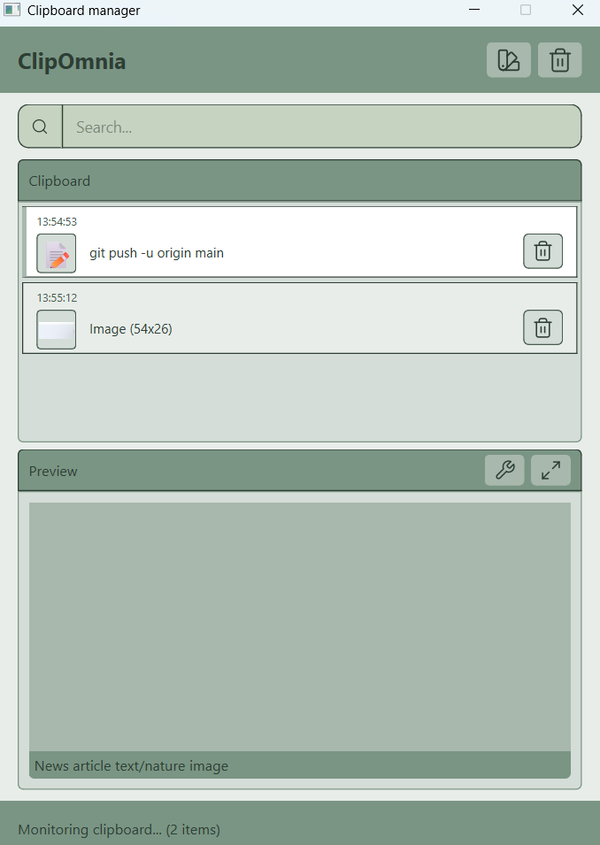

# ClipOmina

**ClipOmina** is a lightweight Pyside6, cross-platform clipboard manager designed to enhance your productivity by keeping track of your clipboard history. Easily access, manage, and reuse your copied text snippets across different applications.

## Features

* **Clipboard History:** Automatically saves your copied text and lets you access previous clipboard items.
* **Cross-Platform:** Works on Linux and Windows ().
* **Quick Access:** Retrieve clipboard items quickly with a simple GUI.
* **Search & Filter:** Easily search through your clipboard history.
* **Lightweight:** Minimal dependencies and optimized performance.



## Dependencies

To run ClipOmina, you need the following Python packages:

* `PySide6==6.10.1`
* `PySide6-Addons==6.10.1`
* `PySide6-Essentials==6.10.1`
* `pyinstaller==6.16.0`

Install them using:

```bash
pip install -r requirements.txt
```

## Installation & Setup

### 1. Setup Python Environment

You can use either **virtualenv** or **pipenv**.

**Virtualenv:**

```bash
python -m venv myenv
source myenv/bin/activate   # Linux/macOS
.\myenv\Scripts\activate    # Windows PowerShell
```

**Pipenv:**

```bash
pipenv shell
pipenv install
```

### 2. Build ClipOmina

#### Linux

```bash
./build_linux.sh   # Requires Docker
```

#### Windows

```bash
build_win.bat
```

### 3. Run ClipOmina

After building, you can launch ClipOmina using:

```bash
python main.py
```

### 4. Simple OCR api

```bash
version: '3.8'

services:
  ocr-api:
    image: mulongobent/clipomnia-ocr:latest
    container_name: tesseract-ocr-api
    ports:
      - "8000:8000"
    restart: unless-stopped
    healthcheck:
      test: ["CMD", "curl", "-f", "http://localhost:8000/health"]
      interval: 30s
      timeout: 10s
      retries: 3
      start_period: 40s
```

## Usage

Once ClipOmina is running:

1. Copy any text as usual. ClipOmina will automatically store it in the clipboard history.
2. Open the ClipOmina window to see your recent clipboard items.
3. Click an item to copy it back to your clipboard.
4. Use the search bar to quickly find previous items.

## License

This project is licensed under the MIT License. See the [LICENSE](LICENSE) file for details.
